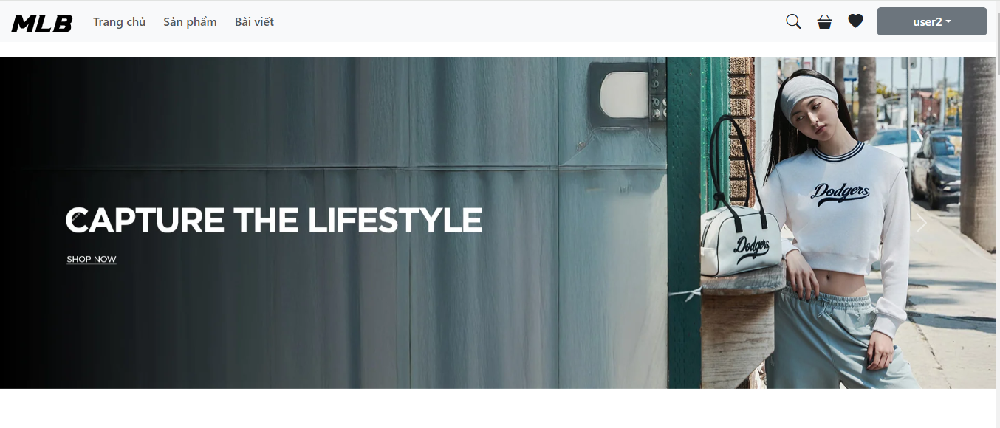
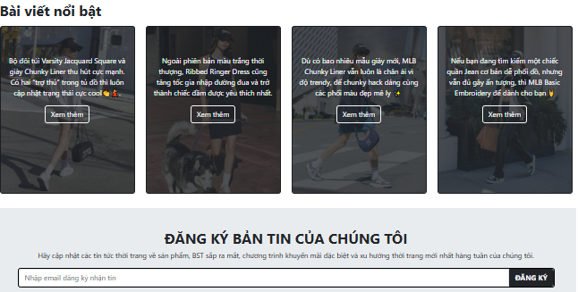

<<<<<<< HEAD
<<<<<<< HEAD

# project_webbanquanao

=======

=======

# project_webbanquanao
>>>>>>> e130d7a89b1e3b2904dfc2ebc32411335d243e5c
# asm

This template should help get you started developing with Vue 3 in Vite.

## Recommended IDE Setup

[VSCode](https://code.visualstudio.com/) + [Volar](https://marketplace.visualstudio.com/items?itemName=Vue.volar) (and disable Vetur).

## Customize configuration

See [Vite Configuration Reference](https://vite.dev/config/).

## Project Setup

```sh
npm install
```

### Compile and Hot-Reload for Development

```sh
npm run dev
```

### Compile and Minify for Production

```sh
npm run build
```

### Lint with [ESLint](https://eslint.org/)

```sh
npm run lint
```
<<<<<<< HEAD

>>>>>>> demo
>>>>>>>
>>>>>>
>>>>>
>>>>
>>>
>>
=======
>>>>>>> e130d7a89b1e3b2904dfc2ebc32411335d243e5c
